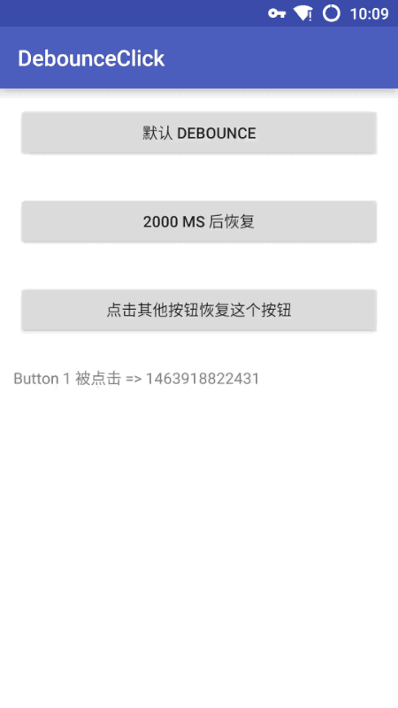

# DebounceClick

防止按钮重复点击一种简单、适应性广的方案

### 演示效果



### 上图中用到的代码：

Button 1，使用默认的延时参数来防止按钮重复点击，在点击后设置按钮不可用持续 300 毫秒，300 毫秒后，重新设置按钮可用，继续接收点击事件
```java
DebounceClick.onClick(findViewById(R.id.button1), new View.OnClickListener() {
    @Override public void onClick(View v) {
        text.append(String.format("Button 1 被点击 => %s\n", System.currentTimeMillis()));
        if (mEvent != null) {
            mEvent.done(); // 恢复 Button 3 状态
        }
    }
});
```
Button 2，使用自定义的时间延时来决定多少毫秒内部接收重复的点击事件，用法和上面相同
```java
DebounceClick.onClick(findViewById(R.id.button2), 2000, new View.OnClickListener() {
    @Override public void onClick(View v) {
        text.append(String.format("Button 2 被点击 => %s\n", System.currentTimeMillis()));
        if (mEvent != null) {
            mEvent.done(); // 恢复 Button 3 状态
        }
    }
});
```
Button 3，自定义逻辑下眼决定按钮什么时候恢复。设定点击事件的通知会额外回调一个 Event 标记对象。在自己的逻辑完成后（例如，网络返回了结果或者出错了），调用 event.done() 来恢复按钮的状态
```java
DebounceClick.onClick(findViewById(R.id.button3), new Callback() {
    @Override public void call(View view, ClickEvent event) {
        text.append(String.format("Button 3 被点击 => %s\n", System.currentTimeMillis()));
        mEvent = event;
    }
});
```
